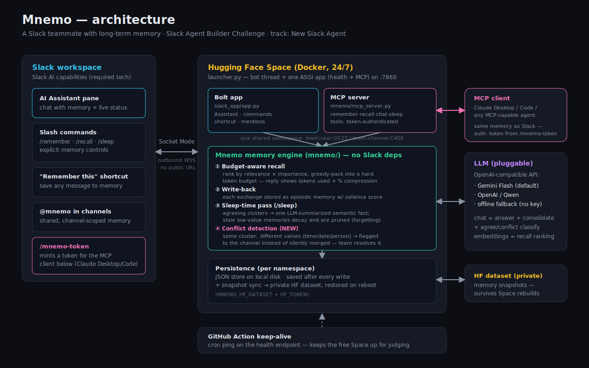

<div align="center">

# 🧠 Mnemo — a Slack teammate that remembers

**Long-term memory for your workspace: budget-aware recall, sleep-time consolidation, and honest forgetting — right inside Slack's AI Assistant pane.**

[](https://docs.slack.dev/ai/)
[](https://tools.slack.dev/bolt-python/)
[](https://himanshukumarjha-mnemo.hf.space)
[](#run-it-yourself)

<sub>Built for the **[Slack Agent Builder Challenge](https://slackhack.devpost.com/)** · track: **Best New Slack Agent** · required tech used: **Slack AI capabilities** (Agents & Assistants)</sub>

</div>

---

## The problem

Every Slack bot has amnesia. You tell it your deadline, your stack, your customer's quirks — and next thread it knows nothing. The naive fix (stuff the whole history into every prompt) gets slower, costlier, and noisier every single day you use it.

**Mnemo treats memory as a budget, not a landfill.** It remembers what matters, recalls only the *minimal critical set* of memories under a hard token budget, and periodically "sleeps" — consolidating related raw events into durable facts and letting stale trivia decay away. Every reply shows its accounting: how many memories it used, how many context tokens that cost, and how much smaller that is than dumping full history.

## What it does in Slack

| Surface | Behavior |
|---|---|
| **🤖 AI Assistant pane** | Chat with memory. Mnemo retrieves under budget, answers, writes new facts back — and shows the token math in each reply. |
| `/remember <text>` | Store a fact explicitly. |
| `/recall <query>` | See exactly what Mnemo would recall about a topic (budget-aware). |
| `/sleep` | Run a consolidation + forgetting pass, and see what got merged, flagged, and pruned. |
| **"Remember this" shortcut** | Save any message to memory from the ⋯ menu. |
| `@mnemo` in a channel | Channel-scoped chat — **shared team memory**, separate from your private one. |
| `/mnemo-token` | Mint a personal token to reach the *same* memory from an MCP client (Claude Desktop/Code). |

Memory is namespaced: DMs and assistant threads are **private per user**; public channels are **shared per channel**. Nothing leaks across.

### Conflicts don't get silently merged

When `/sleep` finds two related memories that actually *disagree* (different times, dates, decisions — not just different wording), it doesn't average them into one fact. It flags both to the channel and asks the team which is current:

> ⚠️ Conflicting memories — these don't agree: "Standup is at 9am." / "Standup is at 9:30am." Let me know which is current with `/remember <the correct fact>`.

This only makes sense for *shared* team memory — a personal notes app can't have two people telling it different things.

### The same memory, outside Slack (MCP)

Mnemo also runs as an MCP server (`mnemo/mcp_server.py`, mounted at `/mcp`), so any MCP client — Claude Desktop, Claude Code, Cursor — can `remember`/`recall`/`chat`/`sleep` against your **own** memory: the exact store your Slack account writes to, not a copy. Run `/mnemo-token` in Slack to mint a token (stateless HMAC, bound to your team+user id, verified without a lookup table), add Mnemo as an MCP server, and tell your client the token once — from then on it shares Slack's memory of you.

## Architecture



The memory engine (`mnemo/`) is pure Python with zero Slack dependencies. Two thin surfaces sit on top of it — the Bolt app (`slack_app/`) and the MCP server (`mnemo/mcp_server.py`) — sharing one process-wide router instance (`mnemo/router.py:get_router`) so a write from either surface is immediately visible to the other, no polling or sync delay:

1. **Budget-aware recall** — memories are ranked by embedding relevance × importance, then greedy-packed into a hard token budget (`MNEMO_TOKEN_BUDGET`, default 400).
2. **Write-back with salience** — every exchange is stored as an *episodic* memory with a heuristic importance score (identity, preferences, numbers, deadlines score higher).
3. **Sleep-time pass** — related episodic memories are clustered; agreeing clusters are LLM-summarized into durable *semantic* facts (raw events demoted), low-value memories decay away on a half-life curve (7 days episodic, ~6× slower for semantic).
4. **Conflict detection** — clusters that *disagree* (not just paraphrase) are flagged instead of merged, and surfaced back to the channel.
5. **Persistence** — one JSON store per namespace, saved after every write, optionally snapshotted to a private HF dataset so memory survives Space rebuilds.

The LLM is pluggable (any OpenAI-compatible endpoint — Gemini free tier by default, OpenAI or Qwen via env), and there's a deterministic offline fallback (including for conflict classification) so everything runs and tests **without any API key**.

## Run it yourself

**1. Create the Slack app** — [api.slack.com/apps](https://api.slack.com/apps) → *Create New App* → *From a manifest* → paste [`slack_app/manifest.yaml`](slack_app/manifest.yaml). Install it to your workspace.

**2. Grab tokens** — the **Bot token** (`xoxb-…`) from *OAuth & Permissions*, and an **App-level token** (`xapp-…`) with `connections:write` from *Basic Information* (Socket Mode is already enabled by the manifest).

**3. Run** (locally, or set the same values as Space secrets):

```bash
pip install -r requirements.txt
export SLACK_BOT_TOKEN=xoxb-...
export SLACK_APP_TOKEN=xapp-...
export LLM_PROVIDER=gemini            # free key: https://aistudio.google.com/apikey
export GEMINI_API_KEY=...
python3 -m slack_app.app              # Socket Mode — no public URL needed
```

Verify the memory wiring with zero credentials:

```bash
python3 -m slack_app.app --selftest   # -> SELFTEST OK
```

### Space configuration

| Secret / variable | Required | Purpose |
|---|---|---|
| `SLACK_BOT_TOKEN` | ✅ | Bot token (`xoxb-…`) |
| `SLACK_APP_TOKEN` | ✅ | App-level token (`xapp-…`), Socket Mode |
| `GEMINI_API_KEY` + `LLM_PROVIDER=gemini` | ✅ | LLM + embeddings (free tier) |
| `MNEMO_TOKEN_SECRET` | ✅ for MCP | HMAC key for `/mnemo-token` — any random string, set once |
| `MNEMO_HF_DATASET` | optional | e.g. `HIMANSHUKUMARJHA/mnemo-memory` — snapshot memory to a private dataset |
| `HF_TOKEN` | optional | write token for the snapshot dataset |

This Space runs the bot 24/7 over Socket Mode plus one ASGI app on port 7860 serving a health check (`/`) and the MCP server (`/mcp`); a scheduled GitHub Action pings the health endpoint so the free Space never idles out.

## Repo layout

```
mnemo/        the memory engine (no Slack imports): store, agent, router, MCP server, LLM client
slack_app/    Bolt app + manifest + glue layer (unit-testable without slack_bolt)
launcher.py   Space entrypoint: bot thread + health/MCP ASGI app
assets/       architecture diagram
submission/   Devpost writeup, demo script, checklist
```

## Judging access

The app is installed in a sandbox workspace with `slackhack@salesforce.com` and `testing@devpost.com` invited. Try the Assistant pane first (tell it two facts, ask it back a paraphrase), then `/recall`, then `/sleep` to watch consolidation (and conflict detection, if you seed a contradiction) happen live. Run `/mnemo-token` to try the same memory from an MCP client.
